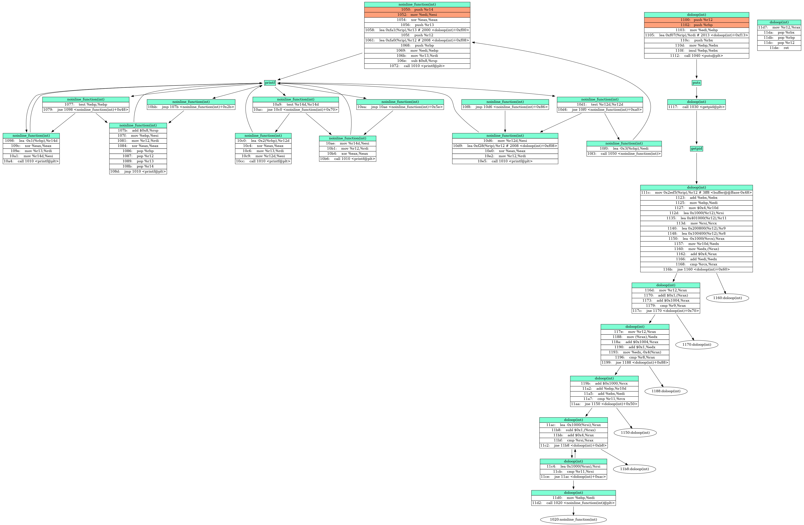

# Object-Dot-Vizualization

<!-- badges: start -->

[](https://www.gnu.org/licenses/gpl-3.0)


<!-- badges: end -->


```plain
Reads an object file, disassembles it and generates a .dot graphviz file for visualization.
usage: viz_disassemble.py [-h] [-m {objdump,gdb}] [-o OUTPUT] [-a ASSEMBLY]
                          file

Reads an object file, disassembles it and generates a .dot graphviz file for
visualization.

positional arguments:
  file                  The input binary file.

optional arguments:
  -h, --help            show this help message and exit
  -m {objdump,gdb}, --method {objdump,gdb}
                        The method to use for disassembly
  -o OUTPUT, --output OUTPUT
                        The graphviz dot output file
  -a ASSEMBLY, --assembly ASSEMBLY
                        The Assembly Code collected from the Method.

```


After running:


```bash
make test.so
python viz_disassembly.py -o test.dot test.so
dot -Tpng -o demo.png test.dot

# Or you can only run 
make
```

The output will be like below:

